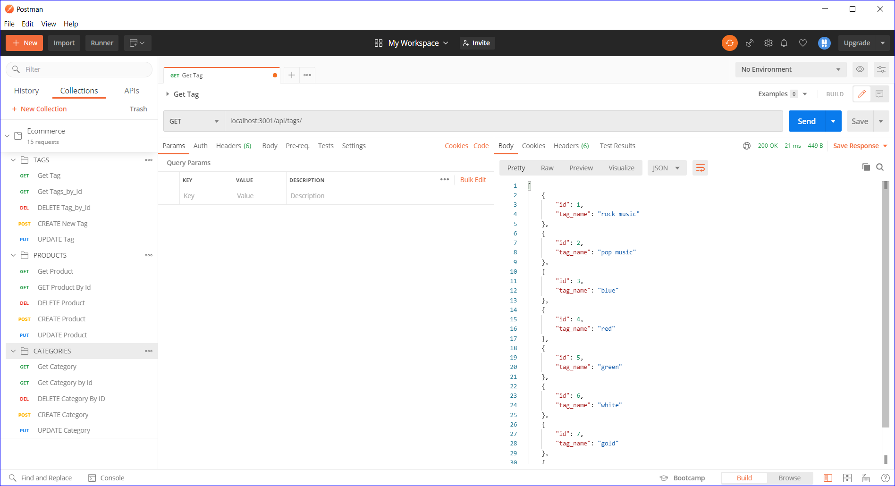
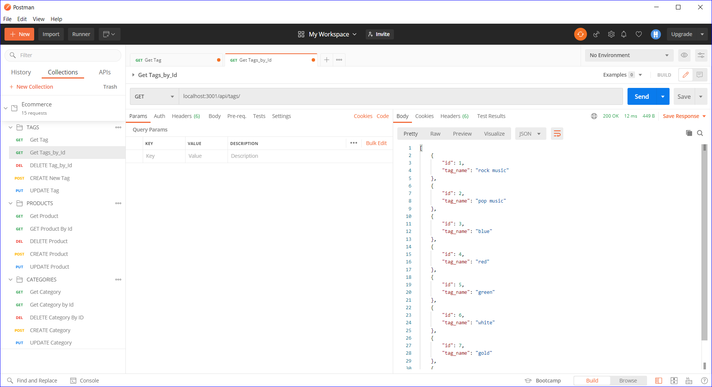

# E-Commerce Back End

## User Story

```md
AS A manager at an internet retail company
I WANT a back end for my e-commerce website that uses the latest technologies
SO THAT my company can compete with other e-commerce companies
```

## Acceptance Criteria

```md
GIVEN a functional Express.js API
WHEN I add my database name, MySQL username, and MySQL password to an environment variable file
THEN I am able to connect to a database using Sequelize
WHEN I enter the schema and seed commands
THEN a development database is created and is seeded with test data
WHEN I enter the command to invoke the application
THEN my server is started, and the Sequelize models are synced to the MySQL database
WHEN I open API GET routes in Insomnia Core for categories, products, or tags
THEN the data for each of these routes is displayed in a formatted JSON
WHEN I test API POST, PUT, and DELETE routes in Insomnia Core
THEN I am able to successfully create, update, and delete data in my database
```

## Mock-Up

Below are some ScreenShots of the Application appearing in the PostMan Application








## Getting Started

You’ll need to use the [MySQL2](https://www.npmjs.com/package/mysql2) and [Sequelize](https://www.npmjs.com/package/sequelize) packages to connect your Express.js API to a MySQL database and the [dotenv](https://www.npmjs.com/package/dotenv) package to use environment variables to store sensitive data.

### Seed the Database

After creating the models and routes, run `npm run seed` to seed data to your database so that you can test your routes.

### Sync Sequelize to the Database on Server Start

Create the code needed in `server.js` to sync the Sequelize models to the MySQL database on server start.

### View the Application via video Click Below:

https://drive.google.com/file/d/1gVjA0zdn9KqLKLYXXva2Wy1zHXZACBtm/viewd893699235e4d57bc3b749203349c1e7c7bb4532

### Questions and Comments

* Please feel free to reach email me at tylersilverman.github.io
